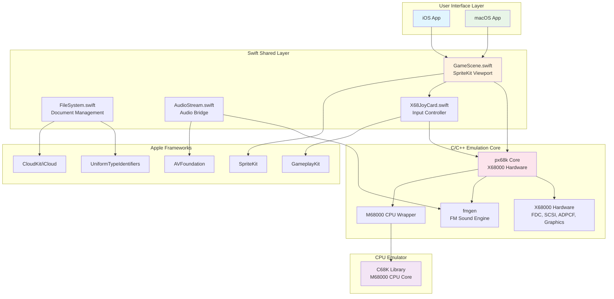
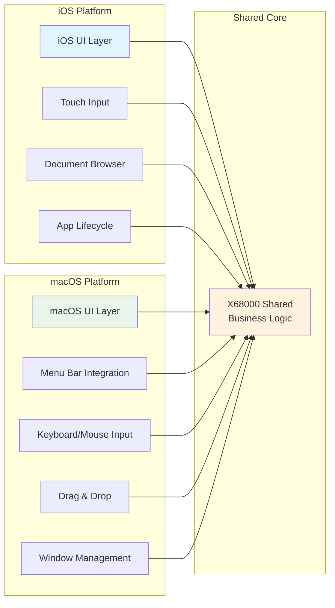
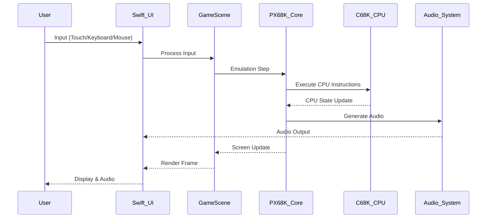
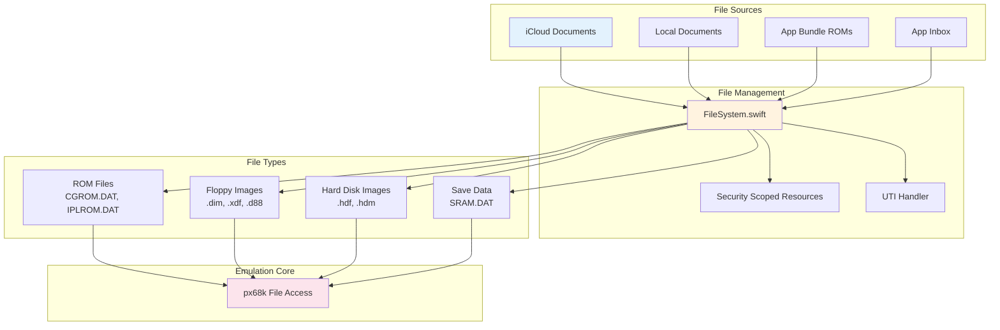
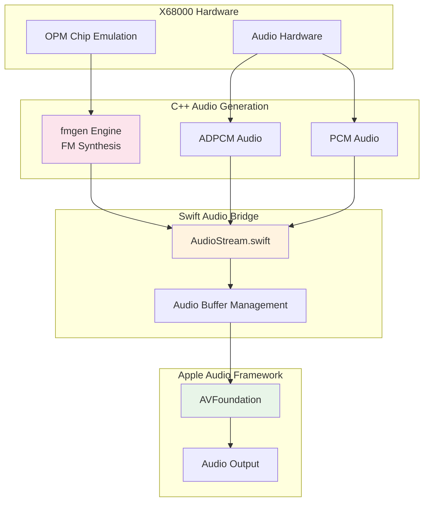
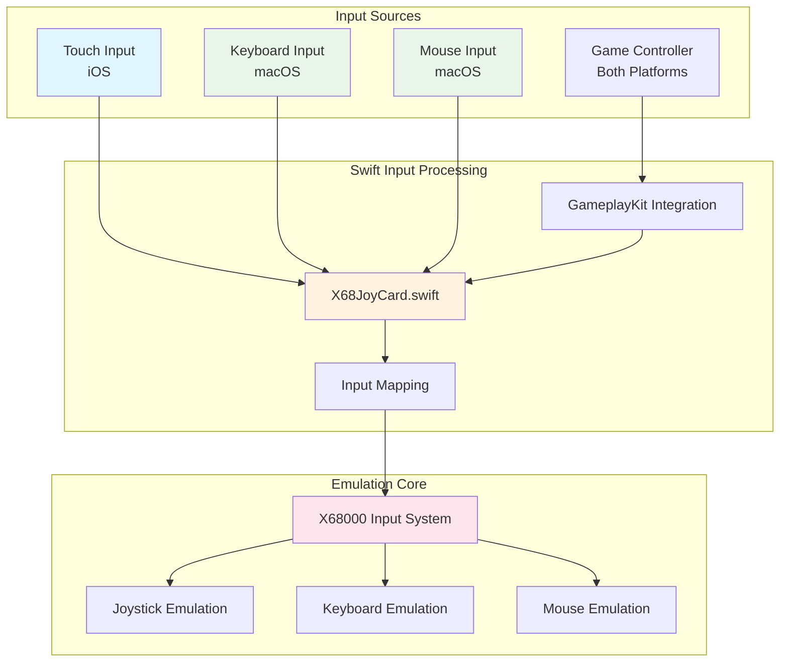
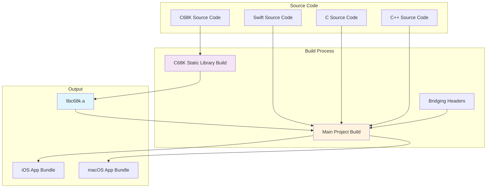

# MPX68K Software Architecture

This document describes the software architecture of MPX68K, a Sharp X68000 emulator for iOS and macOS platforms.

## Overall System Architecture

## Platform-Specific Architecture

## Data Flow Architecture

## File System Architecture

## Audio System Architecture

## Input System Architecture

## Build System Architecture

## Key Design Patterns

### 1. Multi-Platform Strategy
- **Shared Core**: Common business logic and emulation engine
- **Platform-Specific UI**: Separate iOS and macOS presentation layers
- **Conditional Compilation**: Platform-specific code using `#if os()` directives

### 2. Document-Based Architecture
- **File Type Integration**: Custom UTI declarations for X68000 file formats
- **iCloud Synchronization**: Automatic document sync across devices
- **Sandboxed Access**: Security-scoped resource management

### 3. Bridge Pattern
- **Swift-C Interop**: Bridging headers for C API access from Swift
- **Audio Bridge**: AudioStream class bridges C++ audio to AVFoundation
- **Input Bridge**: Unified input system across different input methods

### 4. Emulation Core Isolation
- **Static Library**: C68K CPU emulator as independent static library
- **C/C++ Core**: px68k emulation engine in separate language layer
- **Minimal Dependencies**: Clean separation between emulation and UI layers

This architecture enables MPX68K to provide authentic X68000 emulation while maintaining modern iOS and macOS user experience standards.